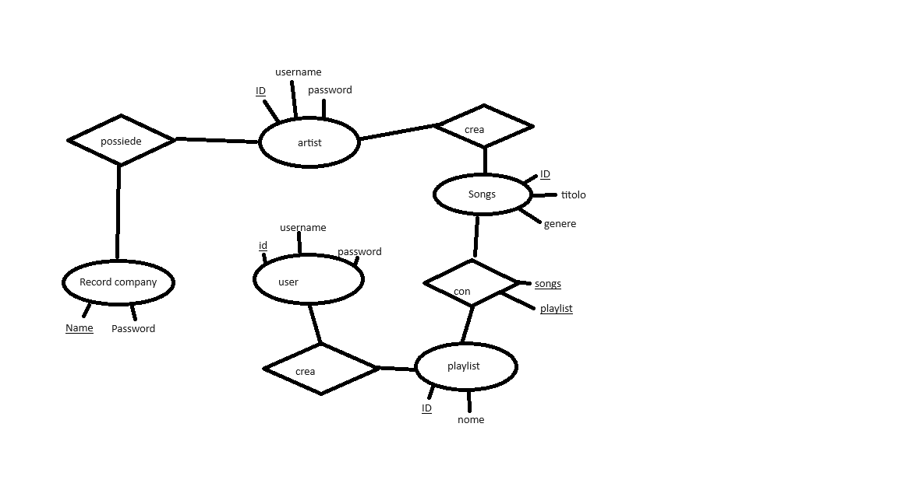

#Generic miusic stream
Targhet: persone con orecchie

##Descrizione
Una generica piattaforma di streaming musicale

##Problema che risolve
Non hai una piattaforma di streaming musicale

##Tecnologie usate
* PHP
* MySQL
* JavaScript

##Funzionalità
- [x] Registra utente
- [x] registra artista
- [x] Aggiungi canzone
    - [x] elimina canzone
    - [x] modifica canzone
- [x] mostra canzone
    - [x] mpostra con filtro
- [] playlist

##Schema relazionale
recordLabel(<ins>name</ins>, password)
artist(<ins>ID</ins>, recordlable_name, username, password)
songs(<ins>ID</ins>, tittle, id_artist, genre)
users (<ins>ID</ins>, username, password)
playlist (<ins>ID</ins>, name, user_id)
playlist_songs (<ins>playlist_id</ins>, <ins>songs_id</ins>)
